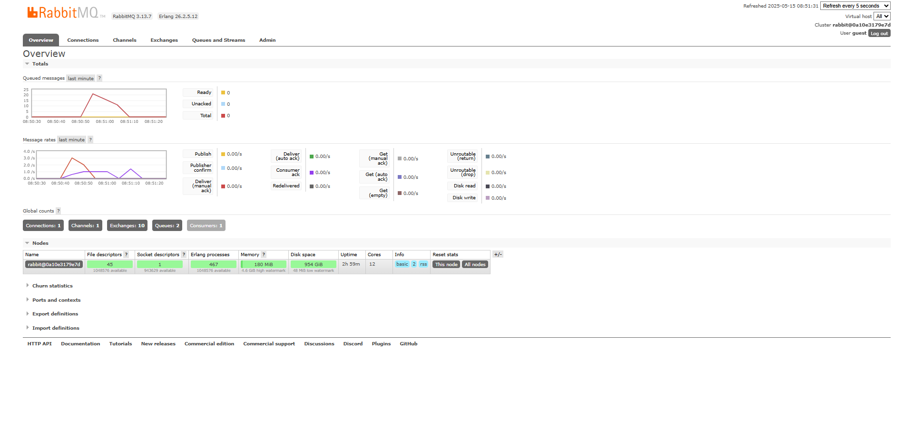

## What is amqp?

AQMP stands for advanced message queuing protocol it is a open standard protocol for message-oriented middleware. It allows differentn systems to communicate with one another through the use of messages. It is mostly used in async communication and event drive architectures and microservices.

## What does it mean? guest:guest@localhost:5672 , what is the first guest, and what is the second guest, and what is localhost:5672 is for? 

First guest is the username for RabbitMQ and the second guest is the password. The localhost is connecting to a locally run RabbitMQ server and the 5672 is the default port used by the AMQP protocol.

## Simulation slow subscriber

I noticed that my machine reached 21, this is because the publisher side will keep publishing sending it to the subscriber but because there is a 1 second delay between each message it processes. So as messages come in the subscriber cannot handle them and therefore it leads to messages stacking up as the rate the come in is faster than the rate they can be processed.